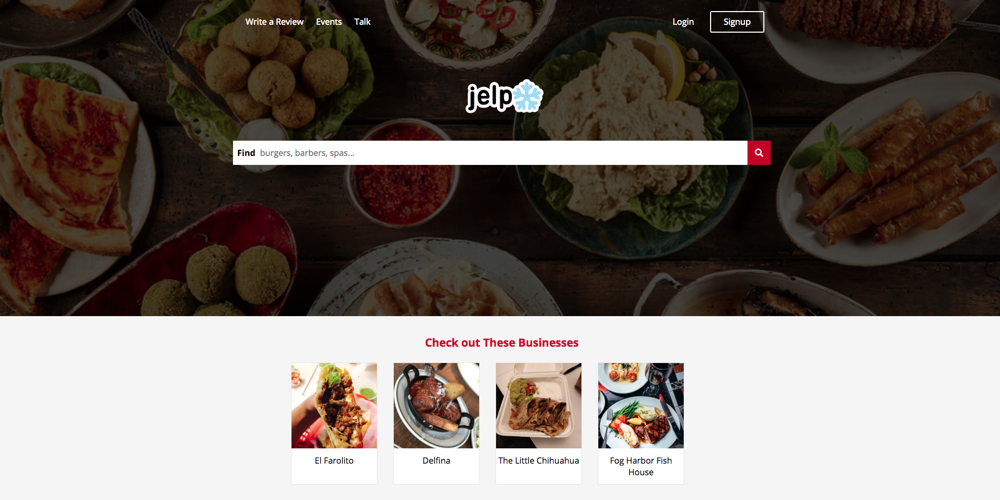
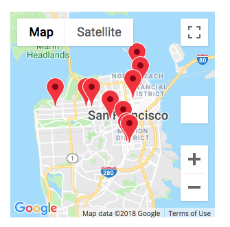
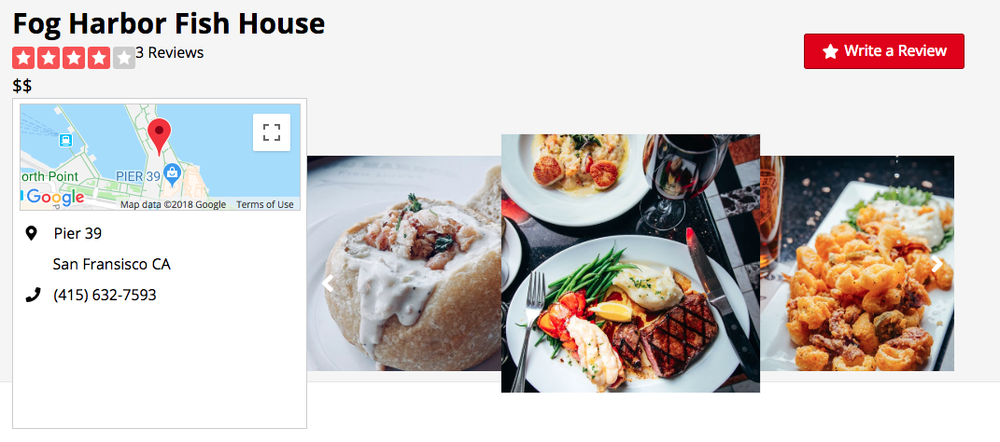
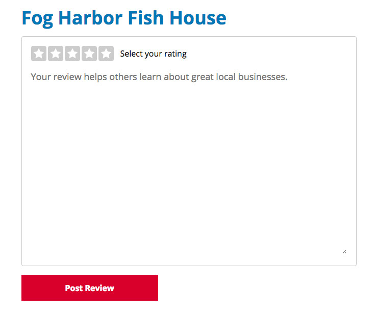

# JELP
[Jelp Live](https://jelp-yelp.herokuapp.com/#/)



Jelp is a clone of Yelp that allows users to search for local businesses. A user can see info about the business as well as review from past guests. If a user would like they can leave a review of thier own and rate the business.

## Technologies

* I used rails for the backend
* PostgresSQL for the database
* React/Redux for the frontend
* CSS for styling

## Fetures

### Hours Table

I implemented a React component that displays the hours of operation by day and if the business is currently open. I did this by getting the current date and time and comparing it to the hours of the business, if the current time fell in the range of the business hours I added a class name to that particualr day so i could style it differently.

```javascript
export default (props) => {

    const status = (day) => {
        const date = new Date();
        const hours = date.getHours();
        const currDay = date.getDay();
        if (day !== currDay) return 'status';
        if (hours >= props.hours[day][0] && hours <= props.hours[day][1]) {
            return 'status active';
        } else {
            return 'status';
        }
    };

    return (
        <div className='hours-widget'>
            <div className='hours-header'>Hours</div>
            <div className='hours-table'>
                <div id='mon' className='day-of-week'>
                    <div className='day'>Mon</div>
                    <div className='hours'>{(props.hours[1][0] >= props.hours[1][1] ? 'Closed' : `${props.hours[1][0]}00 - ${props.hours[1][1]}00`)}</div>
                    <div className={status(1)}>Open now</div>
                </div>
                <div id='tue' className='day-of-week'>
                    <div className='day'>Tue</div>
                    <div className='hours'>{(props.hours[2][0] >= props.hours[2][1] ? 'Closed' : `${props.hours[2][0]}00 - ${props.hours[2][1]}00`)}</div>
                    <div className={status(2)}>Open now</div>
                </div>
                <div id='wed' className='day-of-week'>
                    <div className='day'>Wed</div>
                    <div className='hours'>{(props.hours[3][0] >= props.hours[3][1] ? 'Closed' : `${props.hours[3][0]}00 - ${props.hours[3][1]}00`)}</div>
                    <div className={status(3)}>Open now</div>
                </div>
                <div id='thu' className='day-of-week'>
                    <div className='day'>Thu</div>
                    <div className='hours'>{(props.hours[4][0] >= props.hours[4][1] ? 'Closed' : `${props.hours[4][0]}00 - ${props.hours[4][1]}00`)}</div>
                    <div className={status(4)}>Open now</div>
                </div>
                <div id='fri' className='day-of-week'>
                    <div className='day'>Fri</div>
                    <div className='hours'>{(props.hours[5][0] >= props.hours[5][1] ? 'Closed' : `${props.hours[5][0]}00 - ${props.hours[5][1]}00`)}</div>
                    <div className={status(5)}>Open now</div>
                </div>
                <div id='sat' className='day-of-week'>
                    <div className='day'>Sat</div>
                    <div className='hours'>{(props.hours[6][0] >= props.hours[6][1] ? 'Closed' : `${props.hours[6][0]}00 - ${props.hours[6][1]}00`)}</div>
                    <div className={status(6)}>Open now</div>
                </div>
                <div id='sun' className='day-of-week'>
                    <div className='day'>Sun</div>
                    <div className='hours'>{(props.hours[0][0] >= props.hours[0][1] ? 'Closed' : `${props.hours[0][0]}00 - ${props.hours[0][1]}00`)}</div>
                    <div className={status(0)}>Open now</div>
                </div>
            </div>
        </div>
    )
}
```
### Search

* A user can search for a business by name
* If there are no matches found displays a list of all businesses

### Google Maps API



* Displays a Map of the local area
* Puts a marker on the map for all businesses that match a search

### Business Show



* Displays important information of indvidual business
* Displays a map with a marker of the location
* A user can cycle through all the pictures a business has

### Reviews



* A logged in user can write/edit/delete a review of a business
* A review has a up to a 5 star rating 
* Rating is used to calculate an an average rating for the business
